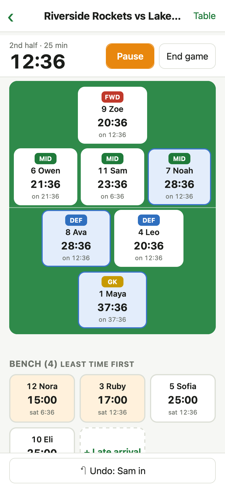
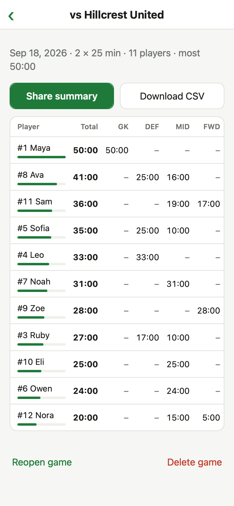

# Sub Assistant

A phone web app for tracking youth soccer playing time from the sideline. Tap to sub, see who's played the least, and share fair minutes with parents after the game. It works offline, and all data stays on your phone.

**Open it:** https://subassistant.soccer

<p>
  
  &nbsp;
  
</p>

## What it does

- **Live game clock** by half or quarter, with stoppage time shown when a period runs long.
- **One-tap subs and position swaps** on a field view laid out by your formation (4v4 through 11v11, or custom).
- **Minutes for every player, split by position**, updated live.
- **Fair-share colors** show who's behind (orange) or ahead (blue) on minutes, and the bench lists the players with the least time first.
- **Undo** for any mis-tap.
- **Late arrivals** can join the bench mid-game.
- **Game summaries and season totals** you can share as text or download as CSV.
- **Built for the sideline:** the screen stays awake while the clock runs (where the browser supports it), and locking the phone, switching apps, or losing signal never loses time.

## Install on your phone

1. Open the link above in Safari (iPhone) or Chrome (Android).
2. **iPhone:** Share → **Add to Home Screen**. **Android:** ⋮ menu → **Add to Home screen** (or **Install app**).
3. Open it once while you have signal. After that it works with no connection.

Add it to your home screen rather than just bookmarking it. On iPhone, Safari can clear a website's saved data after about a week without a visit; apps added to the home screen are exempt.

The app updates itself when it's online. Open it once on Wi-Fi before game day to pick up the latest version.

## Example: a game day

The screenshots show this example: the **Riverside Rockets**, a 7v7 team with 11 kids, two 25-minute halves.

**Before the season:** tap **Add team**, pick the format (7v7), and add the roster with jersey numbers. The formation (1 GK, 2 DEF, 3 MID, 1 FWD) comes from the format. Change it under **Formation → Edit positions**.

**At the field:** tap **New game**, enter the opponent, and tap anyone who isn't there to mark them absent. **Auto-fill** fills the starting lineup; change any spot with its dropdown. Tap **Start game**, then **Start** at kickoff.

**Making subs.** Every sub is two taps:

| To do this | Tap |
|---|---|
| Sub a bench player in | the bench player, then their spot on the field |
| Take a specific player off | their spot on the field, then the bench player going in |
| Swap two positions | one field spot, then the other |
| Take a player off without a replacement | their spot, then **Send … to bench** |
| Add a kid who arrived late | **+ Late arrival**, then their name |

Each field card shows the player's total minutes and how long they've been on ("on 12:36"). Each bench card shows how long they've been sitting ("sat 6:36").

**Halftime:** tap **End period**. The clock stops and none of the break counts. Make your halftime subs, then tap **Start** for the second half.

**Full time:** tap **End game**, then **Save game** for the summary. **Share summary** opens your phone's share sheet (text, email, team chat). **Download CSV** saves a spreadsheet.

### Reading the fair-share colors

Each kid's fair share is the game time so far × players on the field ÷ kids present. In the live screenshot, the game is 37:36 in, with 7 on the field and 11 kids there. That makes a fair share about 24 minutes, with some slack (15%, at least 1 minute) before a color shows:

- **Orange (under about 20 minutes):** Nora (15:00) and Ruby (17:00). They're at the front of the bench, so they're the next two in.
- **Blue (over about 27½ minutes):** Maya in goal (37:36), plus Noah and Ava (28:36 each).
- **No color:** everyone in between.

Colors start two minutes into the game.

### Example output

**Share summary** sends text like this:

```text
Playing time: Riverside Rockets vs Hillcrest United (Sep 18, 2026)

#1 Maya: 50 min — GK 50
#8 Ava: 41 min — DEF 25, MID 16
#11 Sam: 36 min — MID 19, FWD 17
#5 Sofia: 35 min — DEF 25, MID 10
#4 Leo: 33 min — DEF 33
#7 Noah: 31 min — MID 31
#9 Zoe: 28 min — FWD 28
#3 Ruby: 27 min — DEF 17, MID 10
#10 Eli: 25 min — MID 25
#6 Owen: 24 min — MID 24
#12 Nora: 20 min — MID 15, FWD 5
```

**Download CSV** gives you the same numbers for a spreadsheet:

```csv
Player,Number,Total min,GK min,DEF min,MID min,FWD min
Maya,1,50,50,0,0,0
Ava,8,41,0,25,16,0
Sam,11,36,0,0,19,17
...
```

**Season stats** adds games attended (GP) and average minutes per game attended, so a missed game doesn't count against a kid.

## Sideline tips

- **Tap Start at kickoff.** Time only counts while the clock runs, so minutes before you tap Start aren't counted for anyone.
- **Tap End period at the whistle.** If you forget, the clock keeps running through the break and counts it as playing time. You'll see it as extra time on the clock (e.g. "+10:00").
- **Undo** reverses your last action; the button shows what it will undo. Undoing **End period** puts you back in that period with the clock paused where it stopped; tap **Resume** to continue. Undoing a **Pause** treats play as never having stopped.
- **Injury or long stoppage:** tap **Pause**, make any subs, then **Resume**. Paused time doesn't count.
- **Locking the phone or closing the app is fine.** Time is worked out from timestamps, so it's right when you come back.

## Your data

Everything is stored in your phone's browser. Nothing is uploaded, and nobody else can see it. That also means:

- Data doesn't sync between devices, or between Safari and the home-screen app on some phones. Use the same one every game.
- Clearing browser data deletes it, and so can Safari on iPhone if the app isn't on your home screen (see [Install on your phone](#install-on-your-phone)).
- There's no restore, so tap **Download CSV** on each game summary (or on Season stats) to keep your own copy.

## Development

```sh
npm install
npm run dev      # http://localhost:5173
npm test         # all tests (see below)
npm run build    # typecheck + production build into dist/
```

Pushing to `main` runs the tests, builds, and deploys to GitHub Pages at https://subassistant.soccer (`.github/workflows/deploy.yml`). The custom domain is set in the repo's Pages settings; DNS is at Porkbun. The build uses relative paths, so `dist/` also works on any static host (for example, drag it onto https://app.netlify.com/drop).

### Tests

- `src/timing.test.ts`: unit tests for the timing engine.
- `src/scenarios.test.ts`: full simulated games in every format, sideline mistakes (late Start, forgotten End period, wrong sub, double taps, reopening a saved game), and 2,000 randomized games checked second by second against a simple reference model.
- `src/ui.test.tsx`: taps through the real screens in a simulated browser (jsdom) with a fake clock and in-memory storage, from creating a team through subs, halftime, a mid-game reload, the summary, and season stats.

### How it works

- Every game action (start, pause, end period, sub, swap) is saved as an event with a timestamp in IndexedDB.
- Minutes are recomputed from that event log (`src/timing.ts`), which is why locking the phone, switching apps, or reloading never loses time.
- Undo deletes the last event. For End period, it also leaves a pause at the same moment (`undoReplacement` in `src/timing.ts`).
